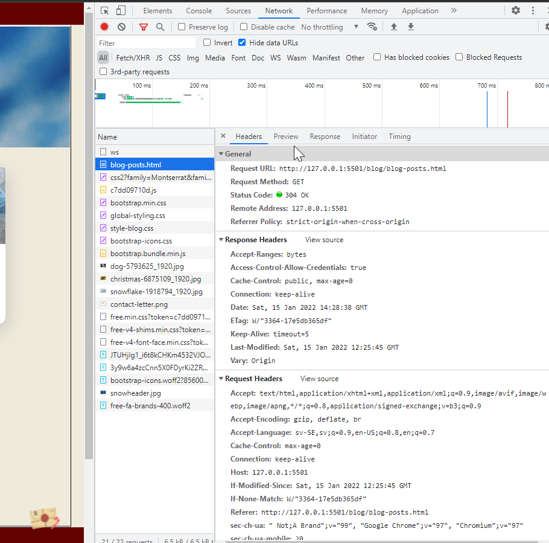
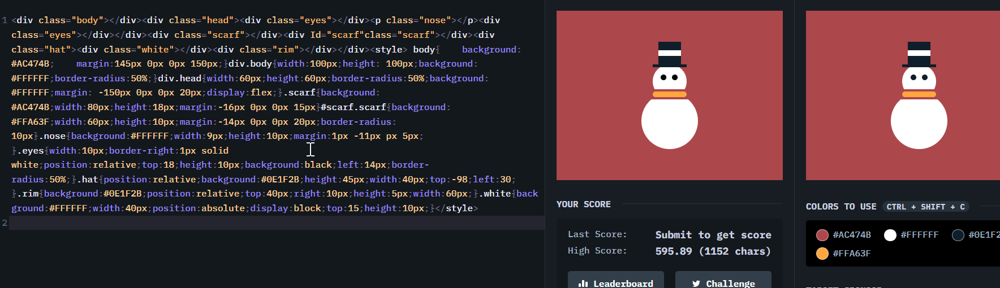

<h2>
Ha med Wireframen du använde för ditt ansvarsområde (png/bmp/jpg/pdf) (Mål 7)
  

 </h2>

  

<h2>
Skriv vilka nyckelord ni valde och vad du gjort för SEO på ditt ansvarsområde. (Mål 6)
 </h2>
Vi valde nyckelorden:
<ol>
<li>Santa</li>
<li>Christmas</li>
<li>Gift</li>
</ol>

Vad jag har gjort för SEO/semantisk html

<ol>
<li>försökt att lägga in nyckelorden i brödtext och rubriker.</li>
<li>Döpt bilder</li>
<li>har använt main, section till viss utsträckning i htmlkoden. </li>
</ol>

<h4>
Använd bilder från Inspector verktyget och förklara i grova lag hur webläsaren använder HTTP för att besöka just din hemsida. (Mål 2)
 </h4>
 
 

clienten och servern kommunicerar via TCP/IP för att skicka data mellan varandra. Webbläsar clienten skickar ett Http-request till servern för att få tag på en kopia av hemsidan ("GET" metoden).
Om allt går som det ska (servern accepterar http-requesten) så skickar servern ett meddelande (200 OK) med innebörden att
den godkänner förfrågan. Därefter börjar servern skicka över websidans data i små-bitar i taget (data-packets)
clienten sätter därefter ihop alla bitar data till en kopia av hemsidan och visar den i browsern.

<h2>
 Förklara varför just den URL som används i HTTP anropet ovan används. (Använd ord som: schema/protokoll, auktoritet/server/domän, sökväg/resurs) (Mål 2) </h2>

Request URL: http://127.0.0.1:5501/blog/blog-posts.html <--- Url till hemsidan som anropas i http-requesten

 <h5>Protokoll (http://</h5>
 Den första biten av url:en, http: eller https: etc, berättar vad för kommunikationsprotokoll som används (regelverk för hur clienten ska kommunicera med servern)

<h5>ip (127.0.0.1) och port (:5501)</h5>
Efter protokoll kommer ip-adressen samt en port som är till för att identifiera enheten.

<h5>resurs/path (/blog/blog-posts.html)<h5>
Visar/navigerar sökvägen bland filerna på hemsidan.
 
 
<h2>Självständigt reflektera över och kritiskt granska de valda lösningarna i projektet gällande design och wireframes, HTML, CSS, samt Bootstrap. </h2>

Jag tycker att dom gemensamma delarna av hemsidan funkar bra, ger ett bra helhetsintryck och känsla.
Men jag tycker att mina delar är lite spretiga, detta beror på att jag hade svårt att hålla mig till en plan, utan bytte flera
gånger under arbetet, jobbade på test-sidor rätt långt in i processen bara för att få testa mig fram till design. Har gjort om
wireframes flera gånger under arbetet också, hade lite svårt med att hålla mig till en konkret plan, för mig är det väldigt
lätt hänt att jag sitter med koden och testar mig fram tills jag får en ny idé och vill ändra design.

Jag har istället för att ha alla blogg-inlägg löpande på en sida, delat upp dom i olika sidor under blogg mappen. Insåg först idag att det kanske inte var rätt tillvägagångssätt då det står tydligt i uppgiften att man skulle ha allt på en och samma sida.

Halvvägs insåg jag att jag ville skrota idéen om att ha en bootstrap-carousel som huvudinnehåll på sidan med syfte av att hinta till tidigare blogg-inlägg. Jag hade väldigt svårt att få carouselen att bli responsiv, och att kontrollera storlek. Om jag hade
haft mer tid så hade jag velat lära mig mer om "sass" och manipulerat carouselen på ett enklare sätt.

Jag valde istället att ha tre stycken bootstrap-"cards" som huvudinnehåll.

Jag kanske inte är supernöjd med mitt arbete på det här projektet men jag är väldigt glad över att ha lärt mig lite grunder kring
css, html och bootstrap, vilket var helt nytt för mig.

Jag hade en idé i början av projektet att lägga in någon fin logotyp eller figur som jag hade kodat i någon av css:battle
utmaningarna. Det smidigare tillvägagångssättet hade nog varit att göra logotypen till en .svg och lagt in den på sidan på så sätt, men jag ville ändå testa att lägga in den "för hand". Och det fungerade faktiskt, så det är jag nog mest nöjd med.

