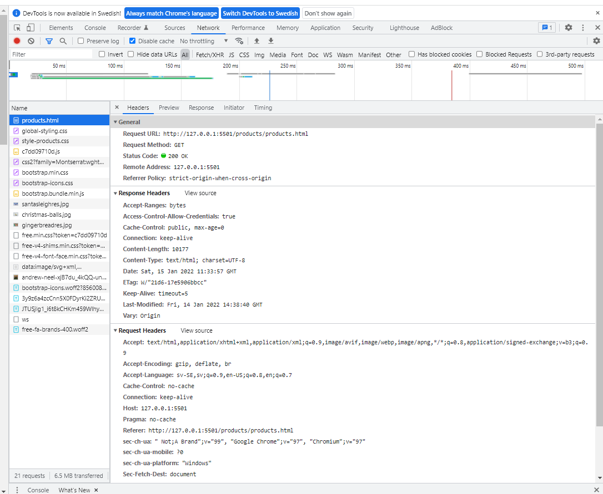
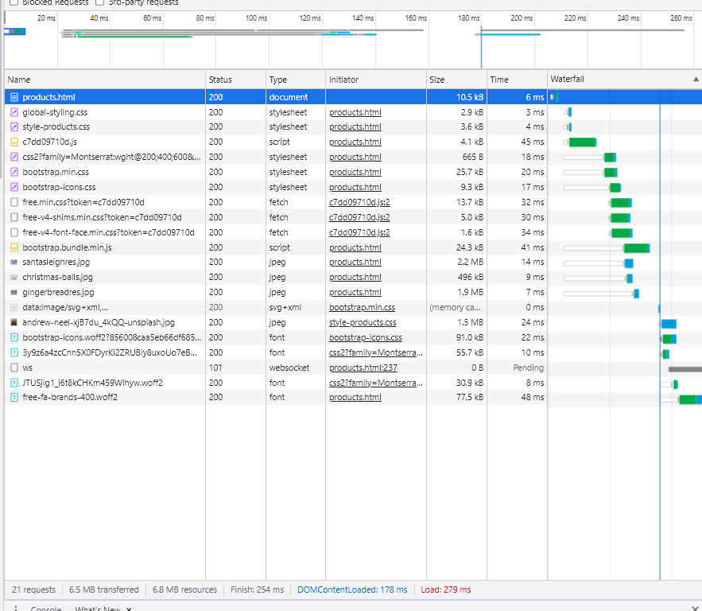
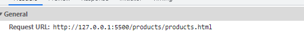

## Wireframes produkt-sidor

## SEO

Bakgrunden till vår webbsida är att vi är ett företag som säljer upplevelser som man kan boka själv eller ge bort i present under vinterhögtider. 
För att hitta de nyckelord som skulle ge vår webbsida mer synlighet har vi undersökt liknande företag samt använt Google Trends för att hitta de mest sökta orden på Google. Vi har kommit fram till en lista med alla de mest populära orden och detta har varit till grund för valet av de tre nyckelorden. Dessa nyckelord är: Christmas, Santa/Santa Claus och gift.
 Dessa tre ord har jag använt på alla produkt-sidor i både brödtext och rubriker. 

För SEO på produkt-sidor har jag använt semantiska element så som: header, section och main samt `<h1>- <h3>` för sidors rubriker och `
` för att tydligt visa paragrafer med text. 
Rubrikerna som har störst betydelse på sidor placerades i `<h1>` element för att poängtera att det är en huvudrubrik för sidan och att den är unik för varje sida. Sådana rubriker innehåller ett av de nyckelord som varit bestämda för vår webbsida.
Valda bilder och ikoner på produktsidorna har en alternate text (alt) som har en tydlig bildbeskrivning, detta är för tillgänglighet och för att ge bättre bildkontext för search engines.
Titles (`<title>`) för varje produkt-sida är beskrivande samt innehåller ett av nyckelorden och detta ger en exakt förståelse vad den sidan handlar om, detta är med tanke på att just denna text ska visas i sökresultat.

## HTTP för att besöka produktsida

HTTP är ett protokoll som fungerar som en kommunikation mellan server och klienten.  Klienten skickar en förfrågan (en http-request) och server i sin tur bearbetar anropet och ger tillbaka ett svar i form av http-respons.  

På bilden ser man att för att göra en förfrågan använder webbläsaren ett protokoll (http), en URL-länk (Request URL: http://127.0.0.1:5500/products/products.html) och request-metoden GET, som är den vanligaste metoden och dess syfte är att hämta önskade data från servern. När klient-server kommunikationen gått igenom får man en status kod som i mitt fall är 200 OK, som betyder att det gick att hämta önskad resurs. Det som skickas med i förfrågan är också en Request Headers som innehåller ytterligare information för server om önskad resurs så som längden och typ på innehållet och användarinformation. Svaret från server finns med i Response Headers.

 Det skickas flera förfrågor samtidigt för att kunna hämta andra objekt också. Man ser alla objekt som man har fått i respons ifrån server, bland annat bootstrap-filer, bilderna och css-filer. Det visas också en status kod för alla requests som är 200 OK i mitt fall samt typ av objekt, initiator, storlek, tiden och vattenfall. 

## URL som används i HTTP anropet

Den första delen av URL:en är schemat, som anger vilket protokoll som webbläsaren använder för att skicka förfrågan. HTTP och HTTPS är de mest vanliga protokollen, där http är den osäkra version och https är den säkra versionen. Efter schema följer en auktoritet (authority) som inkluderar ip-adressen(127.0.0.1:5500) och porten 5500. Vanligtvis så skrivs domänen istället för ip-adressen som t.ex. aftonbladet.se. Domänen specificerar vilken server som ska anropas och porten anges för att kunna komma åt resursen på servern. Men oftast används HTTP egna port 80 (eller HTTPS- 443) och den visas inte i URL:en. Sista delen av URL:en är products/products.html som är en sökväg till resursen på webbservern, den filen som vi efterfrågar.

## Reflektion

För produktsidan använde jag mig av Bootstrap 5.0 i samband med CSS och HTML. Det gick relativt bra att implementera min design med Bootstrap särskilt i frågan om responsivitet och layout. Där jag har använt bootstraps gridsystem och kunde fixa layout med hjälp av klasser `col`, `row` och `container`. Jag har också använt Bootstrap components så som: carousel, card och modal. För vissa element var det svårt att skriva över ett visst bootstrap-beteende med bara CSS. För detta kunde man använda Sass egentligen för smidigare styling av till exempel carousel controlers. 

I designen saknas det en del viktiga element som man ser när man undersöker produkt-sidor hos andra företag bland annat saknas det ett kundbetyg med reviews samt möjlighet till att sätta betyg och lämna ett omdöme. Man skulle också kunna lägga till liknande produkter när användare befinner sig på en specifik produkt-sida. En till grej som saknas är en lista med ytterligare information om upplevelsen så som: åldrar till vilka upplevelsen passar, tillgängliga orter och hur lång tid det tar. Detta skulle göra designen lite mer "levande" och innehållsrik. Sidan är avsedd för mer produkter än bara tre, så jag borde nog lägga till några till produkter för att se hur detta påverkar designen. 
